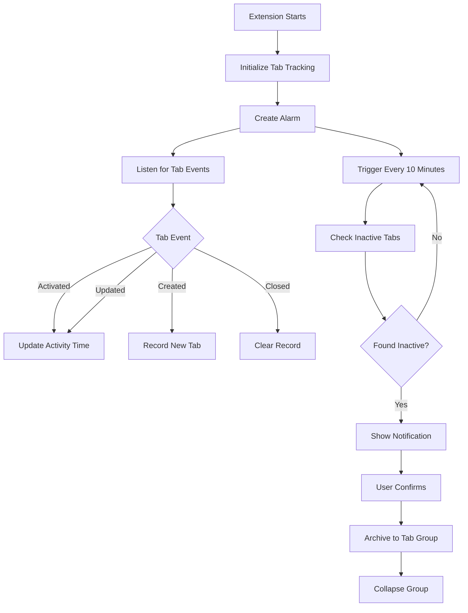

# 📂 Tab Organizer - Smart Tab Management

<div align="center">


**A smart Chrome tab management tool that helps you keep your browser clean and focused**

[Features](#-features) • [Installation](#-installation) • [Usage](#-usage) • [Demo](#-demo) • [Technical](#-technical-implementation)

</div>

---

## 🎯 About

Working with many browser tabs can quickly become overwhelming. **Tab Organizer** automatically tracks and archives inactive tabs, keeping your browser organized and your workflow focused.

### Core Values

- 🎯 **Stay Focused** - Automatically hide tabs you're not using
- ⏰ **Smart Reminders** - Check every 10 minutes for inactive tabs
- 📁 **Elegant Management** - Uses Chrome's native tab groups, never deletes tabs
- 🎨 **Beautiful Interface** - Modern design with intuitive controls

---

## ✨ Features

### 🔍 Real-time Monitoring
- Automatically tracks all tab activity
- Records last access time for each tab
- Intelligently identifies tabs you're actively using

### 📊 Smart Archiving
- Archives tabs inactive for over 10 minutes
- Auto-collapses groups to hide tabs without deletion
- Timestamped group names for easy tracking (e.g., "Archived - Jan 29 14:30")

### 🔔 Periodic Reminders
- Automatic checks every 10 minutes
- Notification prompts for user confirmation
- Customizable check intervals (5/10/15/30 minutes)

### ⚙️ Flexible Settings
- Enable/disable auto-archiving
- Customize check intervals
- Manual archive trigger
- Real-time tab statistics

### 🛡️ Smart Filtering
Automatically skips to avoid accidental archiving:
- ✅ Pinned tabs
- ✅ Currently active tabs
- ✅ Chrome internal pages (chrome://)
- ✅ Extension pages

---

## 📸 Demo

### Main Interface (Popup)

*Click the extension icon to view real-time stats and quick actions*

### Archive Confirmation

*Review and selectively archive inactive tabs*

### Archive Results

*Tabs neatly organized into collapsible groups*

### Workflow Demo

*Complete flow from detection to archiving*

---

## 🚀 Installation

### Option 1: Chrome Web Store (Coming Soon)
> Extension is under review

### Option 2: Manual Installation (Developer Mode)

1. **Download the project**
   ```bash
   git clone https://github.com/your-username/tab-organizer.git
   cd tab-organizer
   ```

2. **Load in Chrome**
   - Open Chrome browser
   - Navigate to `chrome://extensions/`
   - Enable **"Developer mode"** in the top right
   - Click **"Load unpacked"**
   - Select the project folder
   - Done! The extension icon will appear in your toolbar

---

## 📖 Usage

### Quick Start

#### 1️⃣ Automatic Mode (Recommended)
The extension works automatically after installation:
- Monitors all tabs
- Checks every 10 minutes
- Shows notification when inactive tabs are found
- Click notification to review and archive

#### 2️⃣ Manual Mode
Trigger archiving anytime:
- Click the extension icon in toolbar
- View current statistics
- Click "Archive Inactive Tabs Now"
- Review and confirm in the popup

### Detailed Operations

<details>
<summary><b>📋 View Real-time Statistics</b></summary>

Click the extension icon to see:
- Total number of open tabs
- Number of inactive tabs
- Enable status and settings

</details>

<details>
<summary><b>🗂 Archive Tabs</b></summary>

1. Click "Archive Inactive Tabs Now"
2. Review the list of tabs to archive
3. Deselect any tabs you want to keep (all selected by default)
4. Click "Archive X Tabs"
5. Done! Tabs are organized into a group

</details>

<details>
<summary><b>🔍 View Archived Content</b></summary>

Archived tabs are not deleted:
- Find the grey group in your tab bar
- Group name format: "Archived - Mon DD HH:MM"
- Click the group name to expand
- Drag tabs out anytime to restore

</details>

<details>
<summary><b>⚙️ Customize Settings</b></summary>

In the popup interface you can:
- **Enable/Disable**: Toggle auto-archiving
- **Check Interval**: Choose 5/10/15/30 minutes
- **Manual Check**: Click "Check Tab Status"

</details>

### 💡 Pro Tips

1. **Protect Important Tabs**  
   Right-click tab → "Pin tab" to prevent it from being archived

2. **Regular Cleanup**  
   Manually archive once at the end of each day for a clean start

3. **Quick Restore**  
   Need an archived tab? Just click the group name to expand

4. **Custom Interval**  
   Adjust check frequency based on your workflow

---

## 🎨 Interface Design

### Design Highlights
- 🎨 Purple gradient theme (#667eea → #764ba2)
- 💫 Smooth transitions and animations
- 📱 Modern flat design
- 🎯 Clear visual hierarchy
- 😊 Friendly emoji icons

### User Experience
- ✨ Button hover effects
- 🔄 Real-time data updates
- ✅ Instant operation feedback
- 🎯 Clean and intuitive interface

---

## 🛠 Technical Implementation

### Tech Stack
- **Manifest V3** - Latest Chrome extension standard
- **Vanilla JavaScript** - No framework dependencies, lightweight and fast
- **Chrome APIs** - tabs, tabGroups, storage, alarms, notifications
- **CSS3** - Modern styling and animations

### Core APIs

| API | Purpose |
|-----|---------|
| `chrome.tabs` | Get and manage tabs |
| `chrome.tabGroups` | Create and manage tab groups |
| `chrome.storage` | Local storage for activity data |
| `chrome.alarms` | Periodic checks (every 10 minutes) |
| `chrome.notifications` | System notification reminders |
| `chrome.runtime` | Message communication |

### How It Works



### Project Structure

```
tab-organizer/
├── manifest.json          # Extension configuration
├── background.js          # Background service (core logic)
├── popup.html            # Main interface HTML
├── popup.js              # Main interface logic
├── confirm.html          # Archive confirmation page
├── confirm.js            # Confirmation page logic
├── styles.css            # Global styles
├── icons/                # Extension icons
│   ├── icon16.png
│   ├── icon48.png
│   └── icon128.png
├── screenshots/          # Demo screenshots
└── README.md            # Documentation
```

### Code Statistics
- 📝 Total lines: 1,494
- 💻 JavaScript: ~900 lines
- 🎨 HTML/CSS: ~500 lines
- 📚 Comments: 200+ lines (detailed English comments)

---

## 🔒 Privacy

We take your privacy seriously:

✅ **Local Storage** - All data stored locally, never uploaded  
✅ **Minimal Permissions** - Only requests necessary Chrome API permissions  
✅ **No Tracking** - No user behavior data collection  
✅ **Open Source** - Completely transparent, auditable code  
✅ **Metadata Only** - Only reads tab titles and URLs, not page content

---

## 🐛 Troubleshooting

<details>
<summary><b>Notifications Not Showing?</b></summary>

**Cause**: macOS system notification permissions not enabled

**Solution**:
1. Open **System Settings** > **Notifications**
2. Find **Google Chrome**
3. Ensure notifications are enabled
4. Turn off Do Not Disturb mode

</details>

<details>
<summary><b>Can't Find Archived Tabs?</b></summary>

Archived tabs are in tab groups:
- Group name format: `Archived - Mon DD HH:MM`
- Groups are grey and collapsed by default
- Click group name to expand and view
- Tabs still exist, just hidden

</details>

<details>
<summary><b>Extension Not Working?</b></summary>

1. Go to `chrome://extensions/`
2. Find "Tab Organizer"
3. Click refresh icon ⟳
4. Check for error messages
5. View browser console logs

</details>

---

## 🗺️ Roadmap

### v2.0 (Current) ✅
- [x] Real-time tab monitoring
- [x] Smart archiving
- [x] Periodic reminders
- [x] Customizable settings
- [x] Beautiful UI

### v2.1 (Planned)
- [ ] Archive history
- [ ] Statistics dashboard
- [ ] Export/import settings
- [ ] More theme options

### v3.0 (Future)
- [ ] Auto-group by domain
- [ ] AI-powered categorization
- [ ] Keyboard shortcuts
- [ ] Multi-language support
- [ ] Cloud sync

---

## 🤝 Contributing

Contributions are welcome! Feel free to submit issues, suggestions, or pull requests.

### How to Contribute

1. Fork this repository
2. Create your feature branch (`git checkout -b feature/AmazingFeature`)
3. Commit your changes (`git commit -m 'Add some AmazingFeature'`)
4. Push to the branch (`git push origin feature/AmazingFeature`)
5. Open a Pull Request

### Development Setup

```bash
# Clone repository
git clone https://github.com/your-username/tab-organizer.git

# Load extension in Chrome
# 1. Go to chrome://extensions/
# 2. Enable developer mode
# 3. Click "Load unpacked"

# View background logs
# 1. chrome://extensions/
# 2. Click service worker
# 3. View console
```

### Code Standards
- Use meaningful variable and function names
- Add detailed comments
- Follow existing code style
- Test all functionality before submitting

---

## 📄 License

This project is licensed under the MIT License - see the [LICENSE](LICENSE) file for details

---

## 👨‍💻 Author

**Your Name**

- GitHub: [@your-username](https://github.com/your-username)
- Email: your.email@example.com

---

## 🙏 Acknowledgments

Thanks to everyone who has provided feedback and suggestions for this project!

---

## 📞 Support

If this project helps you, please give it a ⭐️ Star!

Questions or suggestions? Feel free to:
- 📝 [Submit an Issue](https://github.com/your-username/tab-organizer/issues)
- 💬 [Join Discussions](https://github.com/your-username/tab-organizer/discussions)
- 📧 Email: your.email@example.com

---

<div align="center">

**Keep your browser clean and stay focused!** 🚀

Made with ❤️ by [Your Name](https://github.com/your-username)

</div>
